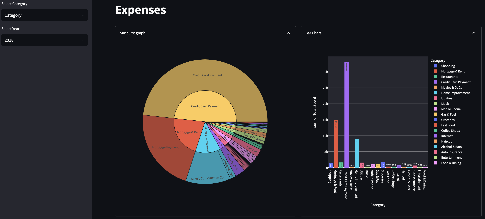

 private-finance-dashboard

### Description
#### This is a project I did to gain a deeper profiency in pandas, Streamlit Dashboard, and Plotly Graph Visualization. The private finance dataset was found on kaggle.com. This project is mainly for showing prospective employers that I posses the skills to comfortably use Python and its libraries and it should not under any case be considered an analytical project. There was nothing of significance to analyse in the dataset. 

